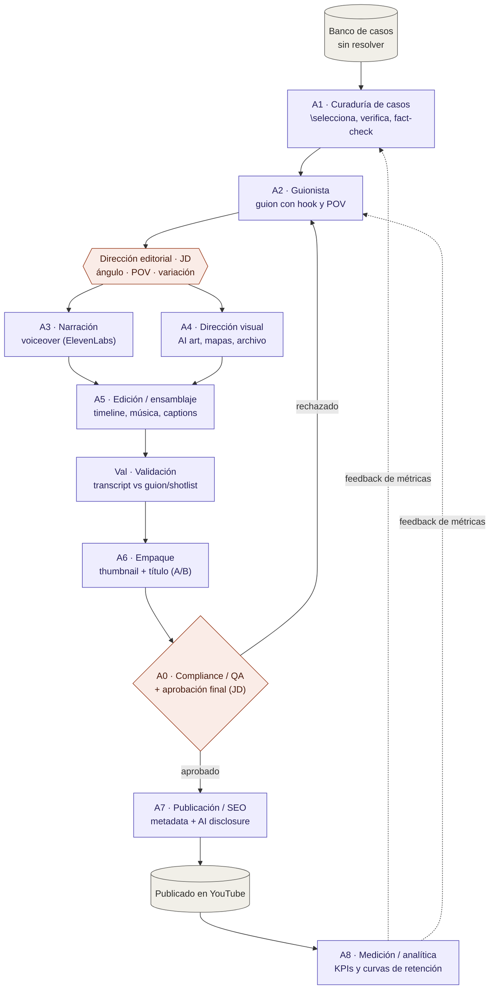

# UMBRA — Arquitectura de producción y medición

**v0.3 — actualizado 2026-06-29** _(v0.2 sellado 2026-06-27 · v0.1 sellado 2026-06-25)_

Codename: **UMBRA**. Nicho: true crime / **casos reales sin resolver** (unsolved cases). Sub-ángulo: **desapariciones**. Idioma: **inglés**. Framing: **línea de exploración y aprendizaje**. NO compite con Proyecto Freedom; no cuenta en proyecciones de runway/FIRE hasta cruzar el scale-gate con unit economics positivos. Presupuesto de tools objetivo: **$50–100 USD/mes**.

---

## 1. Tesis y restricción de diseño 2026

Canal faceless de narrativa de casos sin resolver, audiencia angloparlante. RPM esperado del nicho: **$7–12 USD** (true crime / storytelling).

**Restricción dura — política "inauthentic content" de YouTube (enforced 2026):** los canales 100% AI (TTS + stock footage + sin autoría) son el blanco #1 de desmonetización, aplicada **a nivel de canal completo**: un solo patrón "replicable en una tarde" tumba toda la monetización. En enero 2026 se eliminaron 16 canales (~4.7B vistas, ~$10M USD/año).

**Consecuencia de arquitectura:** los agentes producen borradores; **JD impone juicio editorial y autoría humana en dos compuertas no delegables (H1 y A0).** Esa es la línea que separa a UMBRA de los canales muertos. No es "agente que produce todo y humano que publica" — es "agentes que ejecutan, humano que dirige".

**Kill-gate:** si a M9 no hay YPP full _y_ la tendencia de retención no mejora → cierre, recursos vuelven a optimización de capital. Sin apego.

---

## 2. Diagrama de flujo



**Leyenda:** morado = agente automatizado · coral = compuerta humana (JD) · gris = entrada/salida.

---

## 3. Roster de agentes

| # | Agente | Input | Output | Herramienta | Estado | Riesgo que mitiga |
|:-:|:-:|:-:|:-:|:-:|:-:|:-:|
| A1 | **Curaduría de casos** | nicho + `casos_cubiertos.csv` | `00_dossier.md`: caso, ángulo único, fuentes, fact-check, advertiser-safety | Claude Sonnet | ✅ `.claude/agents/curador.md` | Saturación + sensibilidad publicitaria |
| A2 | **Guionista** | dossier aprobado | `01_guion.md`: cold-open, hook 20s, beats de retención, **POV explícito** | Claude Opus | ✅ `.claude/agents/guionista.md` | Falta de autoría (lo que YouTube castiga) |
| H1 | **Dirección editorial (JD)** | borrador de guion | guion con ángulo/POV/variación impuestos | — (humano) | ✅ Gate en dashboard | Patrón "replicable" → desmonetización |
| A3 | **Narración** | guion final | voiceover | ElevenLabs (~$5–22/mes) o híbrido | ⏳ Manual | Voz robótica genérica |
| A4 | **Dirección visual** | guion final | `02_shotlist.md`: AI art original, mapas, archivo de dominio público | Claude Sonnet | ✅ `.claude/agents/director-visual.md` | Reused content / copyright |
| A5 | **Edición / ensamblaje** | narración + visuales | timeline, pacing, música con licencia, captions | editor de video | ⏳ Manual | Edición mínima = red flag |
| Val | **Validación de video** | transcript auto-generado + guion + shotlist | `04_validacion.md`: semáforos por categoría + veredicto | Claude Sonnet | ✅ `.claude/agents/validador.md` | Video que no corresponde al guion aprobado |
| A6 | **Empaque** | video validado | `05_empaque.md`: título SEO, descripción, tags, thumbnail concept, capítulos | Claude Sonnet | ✅ `.claude/agents/empaquetador.md` | CTR bajo / clickbait-misinfo |
| A0 | **Compliance / QA (+ JD)** | episodio + empaque | `compliance.md`: semáforo de monetización + aprobación humana | Claude Sonnet | ✅ `.claude/agents/compliance.md` + gate en dashboard | Inauthentic content policy |
| A7 | **Publicación / SEO** | video aprobado | metadata, tags, descripción, **AI disclosure**, scheduling por estacionalidad RPM | YouTube Studio | ⏳ Manual | Categorización errónea |
| A8 | **Medición / analítica** | datos de Studio | KPIs, curvas de retención, feedback a A1/A2 | YouTube Studio API | ✅ `.claude/agents/analista.md` | Volar a ciegas |

**Estado:** ✅ = implementado y operativo · ⏳ = pendiente / manual

---

## 4. Compuertas humanas (no delegables)

**H1 — Dirección editorial (post-guion).** JD reescribe el ángulo, impone punto de vista y garantiza variación entre videos. Test: _¿este guion tiene una tesis o perspectiva que solo este canal daría?_ Si no, vuelve a A2.

**A0 — Aprobación de compliance (pre-publish).** Test único: _¿una persona al azar podría copiar este video exacto en una tarde con los mismos prompts y assets?_ Si la respuesta es sí → no se publica, vuelve a A2. Verifica además: AI disclosure marcada, sin footage con copyright, sin reproducción verbatim de fuentes, sensibilidad ética del caso.

---

## 5. Stack de herramientas y costo estimado

| Función | Herramienta | Costo/mes (USD) |
|:-:|:-:|:-:|
| Narración | ElevenLabs | $5–22 |
| Visuales originales | Midjourney | $10–30 |
| Edición | editor (CapCut/Resolve) | $0–25 |
| Música con licencia | Epidemic / similar | $10–15 |
| Investigación + guion + empaque | Claude (Anthropic API) | (uso) |
| Dashboard de producción | Vercel | $0 (hobby) |
| Analítica | YouTube Studio API | $0 |
| **Total** | | **~$50–100** |

---

## 6. Framework de medición

### 6.1 KPIs líderes (semanales) — predicen el resultado

| Métrica | Umbral salud 2026 | Por qué importa |
|:-:|:-:|:-:|
| CTR | > 4–6% | El empaque (A6) funciona o no |
| Retención 30s | > 70% | El hook funciona o no |
| AVD / duración | > 50% | Califica mid-roll (videos > 8 min) |
| Return-viewer % | > 10% | Mayor riesgo del modelo faceless: audiencia "de paso". YouTube 2026 premia comunidad real |

### 6.2 KPIs de progreso (mensuales) — hacia monetización

YPP 2026: acceso temprano = **500 subs + 3 videos + 3,000 h** (o 3M views Shorts) en 90 días. Ad revenue full = **1,000 subs + 4,000 h** (o 10M Shorts).

| Milestone | Target | Compuerta |
|:-:|:-:|:-:|
| M0–M3 | 12 videos · CTR > 4% · retención > 65% | CTR < 3% sostenido → revisar A6 o **kill** |
| M3–M6 | 500 subs + 3,000 h → YPP early access | No a M6 → recalibrar nicho/ángulo |
| M6–M9 | 1,000 subs + 4,000 h → AdSense full | — |
| M9–M12 | RPM real medido · $/video > costo/video | **Scale-gate**: positivo → reinvertir; negativo → **kill** |

### 6.3 Unit economics

- Break-even a $7 RPM ≈ **~14,300 views/video** para cubrir $100/mes prorrateado.
- Costo-sombra del tiempo de JD se contabiliza aparte (no es "gratis").
- Regla de cierre: M9 sin YPP full + retención sin mejora → se cierra.

---

## 7. Roadmap

| Fase | Mes | Foco |
|:-:|:-:|:-:|
| Setup | M0 | Definir sub-ángulo ✅, montar stack ✅, prompts A1/A2 ✅ |
| Producción | M0–M3 | 12 videos, validar CTR + retención |
| Tracción | M3–M6 | YPP early access (500 subs / 3,000 h) |
| Monetización | M6–M9 | AdSense full (1,000 subs / 4,000 h) |
| Decisión | M9–M12 | Medir RPM real → scale o kill |

---

## 8. Infraestructura de producción (implementada)

### 8.1 Dashboard

Next.js 14 App Router desplegado en Vercel (root directory: `dashboard/`). Permite ejecutar el pipeline completo desde el browser sin tocar el repositorio directamente.

| Componente | Ubicación | Función |
|:-:|:-:|:-:|
| Pipeline view | `dashboard/src/components/PipelineView.tsx` | Stepper visual, panel de artefactos, botones de acción por stage |
| Run-agent SSE | `dashboard/src/app/api/episodes/[slug]/run-agent/route.ts` | Ejecuta agente Claude con streaming y guarda output en GitHub |
| File reader | `dashboard/src/app/api/episodes/[slug]/file/route.ts` | Sirve cualquier `.md` del episodio desde GitHub |
| Meta updater | `dashboard/src/app/api/episodes/[slug]/meta/route.ts` | PUT de `meta.yaml` — actualiza stage y campos de gate |
| New episode | `dashboard/src/app/api/episodes/new/route.ts` | Crea carpeta de episodio con `meta.yaml` inicial |
| GitHub helpers | `dashboard/src/lib/github.ts` | Wrappers para GitHub Contents API (leer/escribir/sha) |

**Variables de entorno requeridas en Vercel:**
- `GITHUB_TOKEN` — leer/escribir archivos del repo
- `ANTHROPIC_API_KEY` — ejecutar agentes Claude
- `GITHUB_OWNER` (default: `juand862`)
- `GITHUB_REPO` (default: `Umbra`)
- `GITHUB_BRANCH` (default: `main`)

### 8.2 Stages del pipeline en código

El dashboard maneja un pipeline de stages distinto pero alineado con los agentes del doc:

| Stage (dashboard) | Agente ejecutado | Output | Equivalente doc |
|:-:|:-:|:-:|:-:|
| `curador` | A1 curador | `00_dossier.md` | A1 |
| `dossier` | A2 guionista | `01_guion.md` | A2 |
| `guion` | A2 guionista (re-run post-H1) | `01_guion.md` actualizado | A2 post-H1 |
| `h1` | — (gate manual JD) | aprobación en meta.yaml | H1 |
| `narracion` | A4 director-visual | `02_shotlist.md` | A4 |
| `visuales` | — (manual: AI art, ElevenLabs) | assets de producción | A3 + A4 |
| `ensamble` | Val validador (requiere transcript pegado en UI) | `04_validacion.md` | Val |
| `validacion` | A6 empaquetador | `05_empaque.md` | A6 |
| `empaque` | A0 compliance | `compliance.md` | A0 |
| `a0` | — (gate manual JD) | `approved_by: JD` en meta.yaml | A0 (aprobación) |
| `publicado` | — | estado final; muestra todos los entregables | A7 |

> **Nota:** los stages `visuales` y `ensamble` son manuales. El dashboard los incluye en el stepper pero no tiene agente automatizado — JD produce los assets y avanza el stage manualmente.

### 8.3 Estructura de archivos por episodio

```
episodes/
  EP###_<slug>/
    meta.yaml          # stage, updated, h1_approved, approved_by
    00_dossier.md      # A1 curador
    01_guion.md        # A2 guionista
    02_shotlist.md     # A4 director-visual
    04_validacion.md   # Val validador (transcript vs guion/shotlist)
    05_empaque.md      # A6 empaquetador
    compliance.md      # A0 compliance agent

data/
  casos_cubiertos.csv  # anti-duplicados (A1 consulta antes de elegir caso)
  metricas.csv         # A8 analista
```

### 8.4 Agentes Claude como sub-agentes

Los agentes viven en `.claude/agents/*.md` con frontmatter YAML. El dashboard los fetcha desde GitHub API y los usa como system prompt en llamadas directas a la Anthropic API (streaming SSE). No usan herramientas en el contexto del dashboard — todo el contexto necesario se pasa como archivos en el mensaje de usuario.

**Excepción:** cuando A0 compliance se ejecuta desde el dashboard, recibe `data/casos_cubiertos.csv` además de los archivos del episodio, para poder verificar duplicados en el chequeo de variación.

---

## 9. Estado actual (2026-06-29)

| Item | Estado |
|:-:|:-:|
| Sub-ángulo | ✅ Desapariciones |
| Agentes A1, A2, A4, Val, A6, A0, A8 | ✅ Implementados |
| Dashboard en Vercel | ✅ Producción en `main` |
| Favicon (U blanca en fondo negro) | ✅ Live |
| Botón "Descargar para ElevenLabs" | ✅ En stage guion |
| Stage `validacion` + agente `validador` | ✅ Live (PR #14) |
| EP001 — Rebecca Coriam | ✅ Pipeline IA completo (`stage: publicado`, `approved_by: JD`) |
| EP001 — Producción manual | ⏳ Narración ElevenLabs en progreso |
| EP001 — Video editado | ⏳ Pendiente |
| EP001 — Upload YouTube | ⏳ Pendiente |
| EP001 — Validación post-video | ⏳ Pendiente (ejecutar `validador` con transcript) |
| EP002+ | ⏳ Pendiente |
| A3 narración (ElevenLabs API) | ⏳ Manual (integración futura) |
| A5 edición de video | ⏳ Manual |
| A7 publicación a YouTube | ⏳ Manual |
| Métricas EP001 | ⏳ Pendiente publicación |

---

## 10. Próximos pasos

1. **Completar producción manual EP001**: ElevenLabs (en progreso) → Midjourney (shotlist) → edición → upload YouTube No Listado → transcript → validador → publicar.
2. **Iniciar EP002** desde el dashboard: "Nuevo episodio" → ejecutar curador → dossier → guion → H1.
3. **Medir EP001**: tras 48h de publicación, ejecutar A8 (analista) con datos de YouTube Studio → actualizar `data/metricas.csv`.
4. **Automatizar A3** (narración): integrar ElevenLabs API en el pipeline una vez validado el formato de guion con EP001.
5. **Evaluar kill-gate M3** a los 3 meses con 3–4 episodios publicados.
